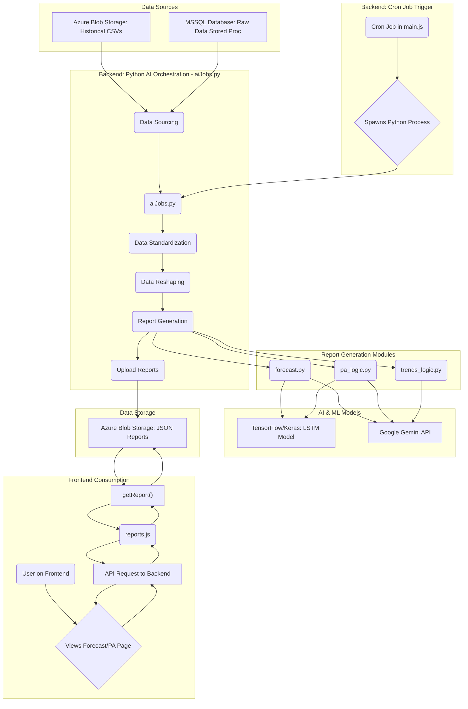
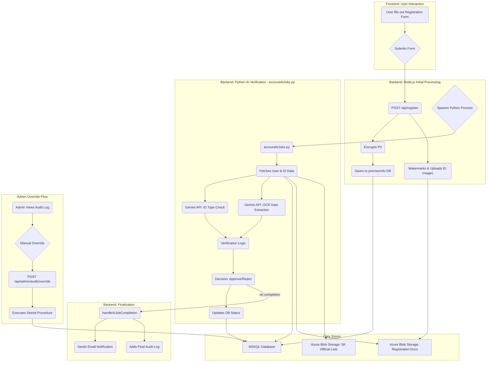
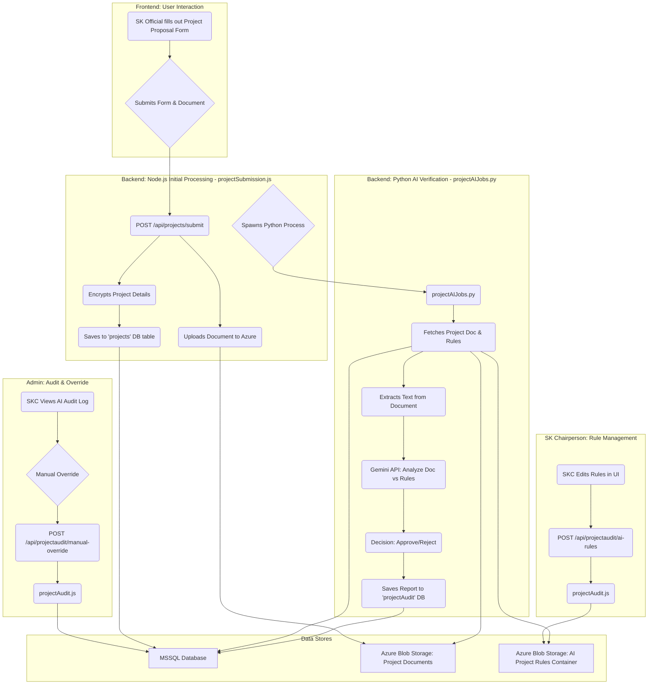

# SmartSK AI Data Flow Diagrams

This document outlines the data flow for the two primary AI-driven processes within the smartSK system: 
1.  **AI-Powered Forecasting and Predictive Analysis**
2.  **AI-Powered Account Registration and Verification**

---

## 1. AI Forecasting & Predictive Analysis Data Flow

This process is triggered automatically on an hourly basis by a cron job. It gathers historical data, performs analysis using both traditional machine learning (LSTM) and generative AI (Google Gemini), and stores the resulting JSON reports for frontend consumption.

### Flow Description:

1.  **Trigger**: An hourly cron job in `main.js` initiates the process by spawning `backend/AI/aiJobs.py`.
2.  **Data Sourcing**: `aiJobs.py` first attempts to fetch historical project data from CSV files stored in an Azure Blob Storage container. If this fails, it falls back to executing a stored procedure in the MSSQL database.
3.  **Processing**: The script standardizes categories and committees, normalizes column names, and reshapes the data from a wide to a long format suitable for analysis.
4.  **AI Analysis**:
    *   `forecast.py` uses an LSTM model (TensorFlow/Keras) for quantitative budget forecasting and calls the Google Gemini API for qualitative analysis of the results.
    *   `pa_logic.py` and `trends_logic.py` use the processed historical data to generate prompts for the Google Gemini API, which returns predictive analysis and project trends.
5.  **Storage**: The generated JSON reports (`forecast.json`, `pa_analysis.json`, `pa_trends.json`) are uploaded to a dedicated container in Azure Blob Storage.
6.  **Consumption**: When a user navigates to the "Forecast" or "Predictive Analysis" pages on the frontend, an API call is made to the Node.js backend. The backend retrieves the corresponding pre-generated JSON file from Azure Storage and sends it to the frontend for rendering.

---

## 2. AI-Powered Account Registration Data Flow

This process is triggered when a user submits the registration form on the frontend. It involves data encryption, document watermarking, and a series of AI-powered verification steps to approve or reject the application automatically.

### Flow Description:

1.  **Submission**: A user fills out the registration form on the frontend, providing PII and uploading front/back images of their ID.
2.  **Initial Handling**: The Node.js backend receives the submission. It encrypts sensitive PII, watermarks the ID images, and uploads them to a secure Azure Blob Storage container. The encrypted user data is saved to a temporary `preUserInfo` table in the database.
3.  **AI Trigger**: The Node.js backend spawns the `accountAIJobs.py` script, passing the new user's ID.
4.  **AI Verification**:
    *   The Python script fetches the user's data from the database and downloads their ID images and the corresponding SK Officials list from Azure.
    *   It makes two calls to the **Google Gemini API**: one to identify the ID type and another to perform OCR to extract text (name, DOB, address).
    *   It runs internal verification logic, comparing the form data against the AI-extracted data and the SK officials list.
5.  **Decision & DB Update**: Based on the verification results, the script decides to 'approve' or 'reject' the application. It then updates the user's status in the database accordingly, either by moving them to the main `userInfo` table via a stored procedure or by marking them as rejected. A detailed verification report is saved to the `registrationAudit` table.
6.  **Finalization**: When the Python script completes, it triggers a final function in the Node.js backend which sends an approval or rejection email to the user.
7.  **Admin Override**: An administrator can view the AI's decision in the audit trail. If necessary, they can manually override the decision, which directly executes a stored procedure to approve or reject the user in the database.

---

## 3. AI-Powered Project Proposal Review Data Flow

This process is triggered when an SK Official submits a project proposal. It uses AI to analyze the attached document against a set of configurable rules, providing an automated initial assessment for the SK Chairperson to review.

### Flow Description:

1.  **Submission**: An SK Official submits a new project proposal, including a title, description, and a project document (PDF/DOCX).
2.  **Initial Handling**: The `projectSubmission.js` endpoint encrypts the project details, uploads the document to a secure Azure Blob Storage container, and saves the initial project record to the `projects` table with a status like `Pending AI Review`.
3.  **AI Trigger**: The Node.js backend then spawns the `projectAIJobs.py` script, passing the new `projectID`.
4.  **AI Verification**:
    *   The Python script fetches the project's document path and the submitter's barangay name from the database.
    *   It downloads the project document and the corresponding rules file (e.g., `PROJECT RULES - [barangayName].txt`) from the `AIPROJ_CONTAINER` in Azure Storage.
    *   It extracts the text from the document and sends it along with the rules to the **Google Gemini API** for analysis.
    *   The AI returns a decision ('approved'/'rejected') and a detailed report.
5.  **Decision & DB Update**: The script saves the detailed verification report into the `projectAudit` table. The project's primary status is updated to reflect the AI's assessment (e.g., `AI Approved` or `AI Rejected`), awaiting final confirmation from the SK Chairperson.
6.  **Rule Management**: The SK Chairperson can, at any time, update the AI criteria for their barangay through a dedicated UI. Saving these rules updates the corresponding text file in Azure Blob Storage via the `projectAudit.js` endpoint.
7.  **Admin Audit & Override**: The SK Chairperson reviews the AI's decisions in the "AI Review" tab. If they disagree, they can use the "Override" functionality. This action updates the project's final status in the `projects` table and logs the manual action, justification, and the admin's identity in the `projectAuditManual` table.