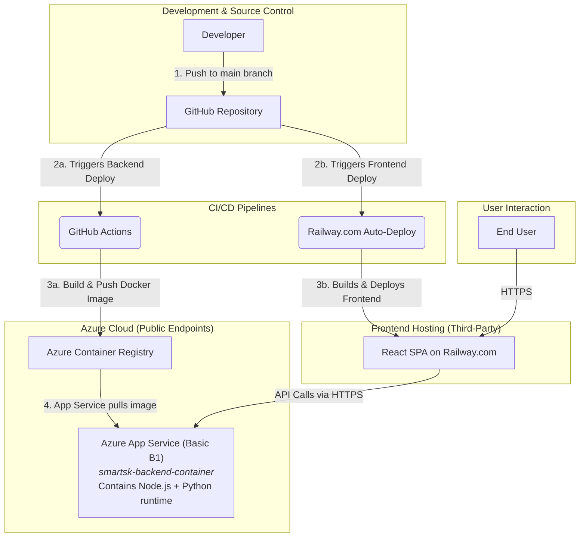
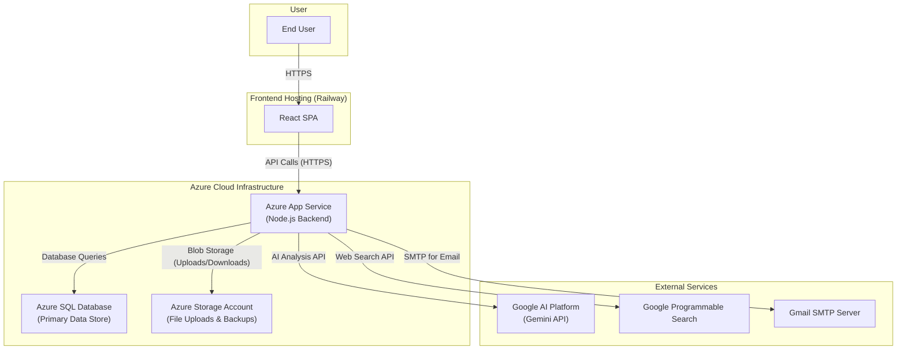
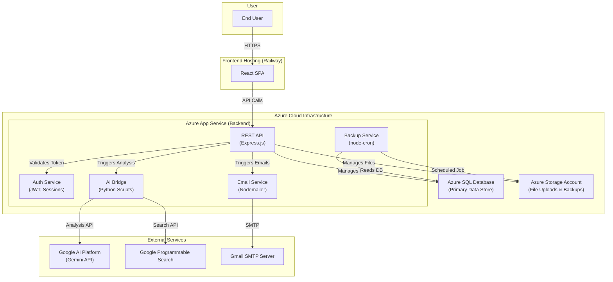

# SmartSK System Architecture

This document provides diagrams illustrating the deployment and infrastructure architecture of the SmartSK system.

## Deployment Architecture

This diagram illustrates the current CI/CD and deployment process for the SmartSK system, based on the GitHub Actions workflow and hosting provider configurations.

## Infrastructure Design

This diagram shows the high-level logical design of the provisioned cloud infrastructure and the data flow between the system components and external services.

## Detailed Infrastructure Design

This diagram provides a more granular view of the backend architecture, breaking down the Azure App Service into its logical software components and showing their specific interactions.

